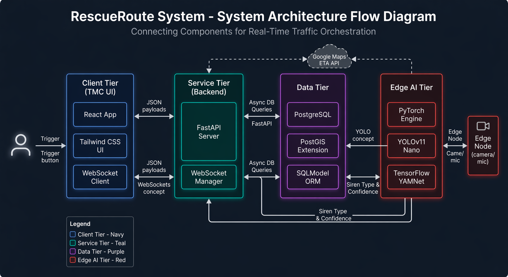
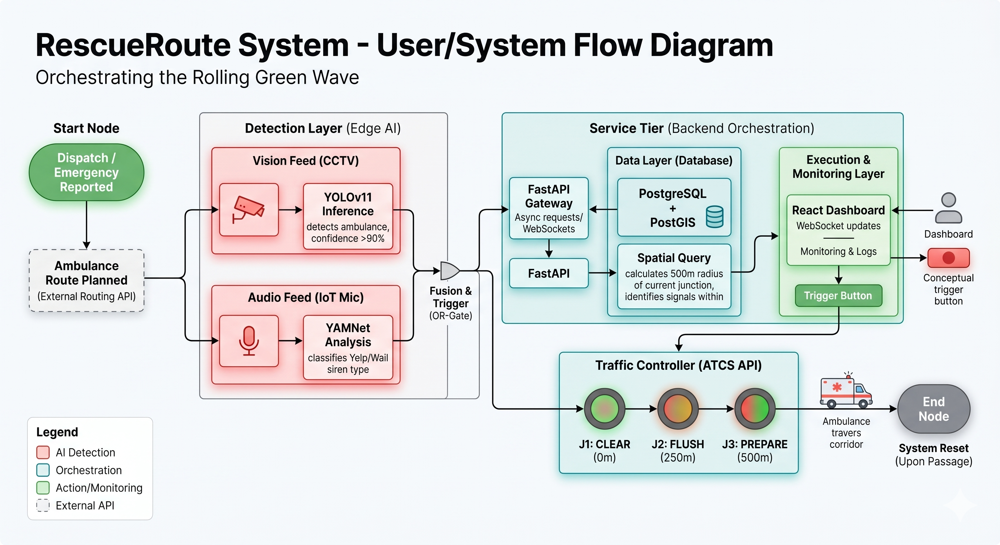

# RescueRoute (Alpha Squad)

RescueRoute is a multimodal emergency-priority platform for Bengaluru that orchestrates a rolling green wave for ambulances using:

- FastAPI + SQLModel + PostGIS (backend)
- YOLO + YAMNet sensor fusion (AI engine)
- Next.js command center + Mappls map + realtime websocket stream (frontend)

## Architecture Diagrams

### System Architecture Flow



### User/System Flow



## Prerequisites

- Python 3.12+
- Node.js 20+
- `uv` installed ([docs](https://docs.astral.sh/uv/))
- Neon/PostgreSQL database with PostGIS enabled

## Environment Setup

1. Copy `.env.example` to `.env` if needed.
2. Fill required values:
   - `NEON_DATABASE_URL`
   - `MAPPLS_API_KEY`
   - `MAPPLS_SECRET`
   - `NEXT_PUBLIC_MAPPLS_API_KEY`

## Install Dependencies

From repo root:

```bash
uv sync
```

Frontend dependencies:

```bash
cd frontend
npm install
```

## Startup Order (Local Demo)

1) Start backend (repo root):

```bash
uv run uvicorn backend.app.main:app --reload
```

2) Start frontend:

```bash
cd frontend
npm run dev
```

3) Optional: start AI engine stream (repo root):

```bash
uv run python ai_engine/main.py
```

4) Run Bengaluru simulation (repo root):

```bash
uv run python simulate_blr.py
```

## Main Endpoints

- Health: `GET /health`
- Ambulance ingest: `POST /ambulance/{vehicle_id}/location`
- Role websocket: `WS /ws/{role}` (e.g. `ai_engine`, `frontend`)

## WebSocket Payload Examples

### Simulator / AI -> Backend (`AMBULANCE_LOCATION`)

```json
{
  "type": "AMBULANCE_LOCATION",
  "vehicle_id": "KA01RR1001",
  "lat": 12.9442,
  "lng": 77.6563,
  "confidence": 0.96,
  "sequence": 5
}
```

### Backend -> Frontend (`GREEN_WAVE_TRIGGER`)

```json
{
  "type": "GREEN_WAVE_TRIGGER",
  "vehicle_id": "KA01RR1001",
  "triggered_signal_ids": [11, 14],
  "etas": [
    {
      "id": 11,
      "junction_name": "Domlur Flyover Junction",
      "lat": 12.9601,
      "lng": 77.6412,
      "eta_seconds": 22
    },
    {
      "id": 14,
      "junction_name": "Old Airport Road Signal",
      "lat": 12.9638,
      "lng": 77.6602,
      "eta_seconds": 29
    }
  ]
}
```

### Backend -> AI (`AMBULANCE_LOCATION_UPDATED`)

```json
{
  "type": "AMBULANCE_LOCATION_UPDATED",
  "vehicle_id": "KA01RR1001",
  "location": { "lat": 12.9442, "lng": 77.6563 },
  "nearby_signals": []
}
```

### Backend ACK on websocket ingest (`AMBULANCE_LOCATION_ACK`)

```json
{
  "type": "AMBULANCE_LOCATION_ACK",
  "vehicle_id": "KA01RR1001",
  "updated": true,
  "nearby_signals": 3,
  "triggered_signal_ids": [11]
}
```

## Notes

- Keep real keys in `.env`, not in `.env.example`.
- `ai_engine/main.py` currently uses a placeholder audio chunk; replace with microphone stream for live siren detection.